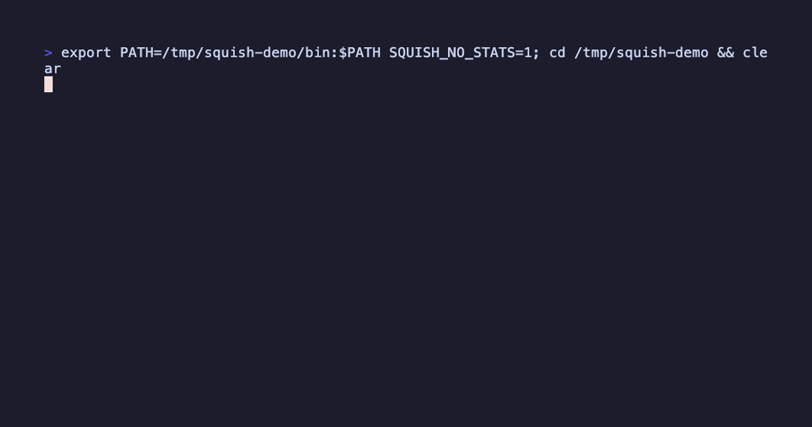

<p align="center">
  <picture>
    <source media="(prefers-color-scheme: dark)" srcset="assets/squish-white.png">
    
  </picture>
</p>

Super fast local file optimisation. Compresses images, video, and audio; minifies JS, TS, CSS, HTML, and JSON — all from one CLI, no servers, no uploads. Takes files or directories, writes `*_squished.*` siblings alongside the originals (or replaces in place with `-o`). Non-destructive by default — originals are never touched unless you ask.



### What to expect

Measured on representative samples with default settings (your mileage varies with content):

| Input | Saving |
|---|---|
| High-quality JPEG photo (4.4 MB) | −69% |
| PNG screenshot/graphic | −77% |
| WebP | −44% |
| SVG | −54% |
| TIFF (auto-converts to JPEG) | −97% |
| MP4 with `--target-size 1M` (3.1 MB source) | −68%, under budget |
| 320 kbps MP3 | −84% |

## Install

### Homebrew (macOS — recommended)

```bash
brew install mikedre/tap/squish
```

Installs a prebuilt binary plus every system dependency (ffmpeg, gifsicle, libheif, dav1d). Nothing else to do.

### Prebuilt binaries

Each release ships binaries for macOS (arm64/x64) and Linux (x64/arm64) on the [releases page](https://github.com/MikeDre/squish/releases). Unpack and put `squish` on your PATH. Linux binaries need `libheif` (≥ 1.18) and `dav1d` (≥ 1.3) present at runtime, plus the subprocess dependencies below for full format coverage.

### Install via cargo

If you have Rust installed (see step 1 below):

```bash
cargo install squish-media-cli --locked
```

This compiles squish from crates.io and places the `squish` binary in `~/.cargo/bin`. You still need the system dependencies for full format support (see below).

> **Why `--locked`?** It installs the exact dependency versions squish was tested and released with (from the published `Cargo.lock`). Without it, cargo re-resolves transitive dependencies and may pick newer versions that fail to compile — notably the pinned `lightningcss` CSS engine against a newer `cssparser`. Always prefer `--locked` when installing squish from crates.io.

With [`cargo binstall`](https://github.com/cargo-bins/cargo-binstall) installed, `cargo binstall squish-media-cli` fetches the prebuilt release binary instead of compiling (macOS and Linux only — Windows isn't published yet, see Roadmap).

### Build from source

**1. Install Rust** (skip if `rustc --version` already works):

```bash
curl --proto '=https' --tlsv1.2 -sSf https://rustup.rs | sh
```

Once the installer finishes, open a **new terminal** (or run `source ~/.cargo/env`) so that `cargo` is available on your PATH.

> **Note:** squish builds on stable Rust (1.95 or newer). If your toolchain is older, run `rustup update` first.

**2. Install system deps and build:**

```bash
./scripts/setup.sh    # installs system deps via Homebrew (macOS) or apt (Linux)
cargo install --path crates/squish-cli --locked
```

**3. Make sure `squish` is on your PATH:**

`cargo install` places the binary in `~/.cargo/bin`. If `squish` isn't found after installation, add that directory to your shell profile and reload it:

```bash
# bash
echo 'export PATH="$HOME/.cargo/bin:$PATH"' >> ~/.bashrc && source ~/.bashrc

# zsh
echo 'export PATH="$HOME/.cargo/bin:$PATH"' >> ~/.zshrc && source ~/.zshrc
```

Then verify with `squish --version`.

### System dependencies

GIF and HEIC support require external libraries. Install them for full format coverage:

- **`gifsicle`** (required for GIF compression)
  - macOS: `brew install gifsicle`
  - Linux: `apt install gifsicle`
- **`libheif` + `x265`** (required for HEIC/HEIF)
  - macOS: `brew install libheif x265`
  - Linux: `apt install libheif-dev libx265-dev`
- **`dav1d`** (required for AVIF decoding)
  - macOS: `brew install dav1d`
  - Linux: `apt install libdav1d-dev`
- **`ffmpeg`** (required for video compression)
  - macOS: `brew install ffmpeg`
  - Linux: `apt install ffmpeg`

If a dependency is missing when you need it, squish tells you exactly what to install.

### Shell completions

`squish completions <shell>` prints a completion script to stdout for `bash`, `zsh`, or `fish`, generated from the CLI's own flag definitions so it never drifts out of sync.

```bash
# zsh
squish completions zsh > "${fpath[1]}/_squish"

# bash (requires bash-completion)
squish completions bash > /usr/local/etc/bash_completion.d/squish   # macOS (Homebrew)
squish completions bash | sudo tee /etc/bash_completion.d/squish    # Linux

# fish
squish completions fish > ~/.config/fish/completions/squish.fish
```

Open a new shell (or `exec $SHELL`) afterward. The Homebrew tap installs completions automatically — see below.

### Man page

The Homebrew tap installs `man squish` automatically. Building from source or installing via `cargo install`, generate it yourself:

```bash
squish man > /usr/local/share/man/man1/squish.1   # then `man squish`
```

## Use

### Images

```bash
# Single file
squish dog.png
# → dog_squished.png

# Whole folder, recursively
squish ./assets/ -r

# Convert format while compressing
squish photos/ -r --format webp --quality 75

# Preserve every bit (lossless)
squish logo.svg --lossless

# Resize while compressing (never upscales)
squish photos/ -r --max-width 2000

# Fit within a box
squish hero.jpg --max-width 1920 --max-height 1080

# Crop to a preset aspect ratio (largest centred fit), then compress
squish hero.jpg --crop 16:9

# Square-crop a whole folder, anchored to the top of each image
squish avatars/ -r --crop 1:1 --gravity north

# Crop an exact pixel region: WxH+X+Y
squish scan.png --crop 800x600+120+40

# Compress to a size budget (highest quality that fits)
squish hero.jpg --target-size 500k

# Compress as hard as possible with no visible loss (perceptual auto-quality)
squish photo.jpg --quality auto

# Web-optimize: resize to fit within 1920x1920 (portrait or landscape), convert to WebP, visually-lossless quality (H.264 for video)
squish ./assets -r --preset web

# Preview without writing
squish ./big-folder/ -r --dry-run

# Keep watching a folder, squishing files as they land
squish ./assets/ -r --watch
```

### Video

```bash
# Compress a video (defaults to H.265)
squish video.mp4
# → video_squished.mp4

# Use H.264 instead
squish video.mp4 --codec h264

# Fast mode — optimise without re-encoding
squish video.mp4 --fast

# Compress as hard as possible with no visible loss (perceptual auto-quality, requires libvmaf)
squish video.mp4 --quality auto

# Fit a clip under an upload limit (two-pass ABR for H.264/H.265/VP9)
squish clip.mp4 --target-size 8M

# Mixed batch — images and videos together
squish ./media/ -r
# → Squished 8 files (5 images, 3 videos) · 120.3 MB → 34.1 MB (-71.7%)

# Convert a .mov to .mp4 (re-encodes with the container default codec)
squish trailer.mov --format mp4
# → trailer_squished.mp4
```

### Audio

```bash
# Single file — re-encode at the same codec with sensible quality
squish track.mp3

# Convert a lossless file to Opus (~50% size reduction)
squish --codec opus song.flac

# Pick a specific bitrate
squish --bitrate 192k podcast.mp3

# Strip ID3 tags and album art
squish --strip-tags album/*.mp3

# Fit a podcast under a size budget (bitrate computed from duration)
squish episode.mp3 --target-size 25M

# Convert lossless to a specific container/codec
squish song.flac --format opus
# → song_squished.opus
```

### Code

```bash
# Minify everything in dist/ recursively
squish dist/ -r
# → app.js → app.min.js, style.css → style.min.css, …

# Safe mode — whitespace-only, no identifier mangling
squish --safe app.js

# Emit a source map alongside the minified output
squish --source-map app.js style.css
```

### Usage report

```bash
# How much have I saved this month + all-time?
squish --stats

# Skip recording this run (also: SQUISH_NO_STATS=1)
squish photos/ -r --no-stats
```

### Check your setup

See which formats work on this machine and whether the optional tools are installed:

```bash
squish doctor
```

Images and code minification work out of the box. Video and audio need
`ffmpeg`, and GIF needs `gifsicle`; `doctor` shows what's present (with
versions) and how to install anything missing. It always exits 0.

### Scripting

`--json` prints a single machine-readable report to stdout instead of the human summary — nothing else goes to stdout, so it's safe to pipe straight into `jq` or parse in CI:

```bash
squish photos/ -r --json | jq '.totals'
# { "files": 8, "bytes_in": 12345678, "bytes_out": 3456789, "saving_pct": 72.0, "by_kind": {...} }

squish photos/ -r --json | jq -r '.files[] | select(.status == "squished") | "\(.input) -> \(.output)"'

# Exit code is unaffected by --json: 0 clean, 1 if any file errored.
squish photos/ -r --json > report.json || jq '.errors' report.json
```

Works with `--dry-run` too (every planned file reports `status: "skipped"` with no `output`, since nothing is written).

## Formats

### Images

Supported as **input** and **output**: PNG, JPEG, WebP, AVIF, SVG, GIF, HEIC, TIFF.

| Format | Library | Metadata |
|---|---|---|
| PNG | `oxipng` + `imagequant` | EXIF stripped by default, ICC always kept; `--keep-metadata` preserves EXIF too |
| JPEG | `mozjpeg` (progressive, optimised Huffman) | EXIF orientation always applied to pixels before re-encoding; EXIF stripped by default, ICC always kept; `--keep-metadata` preserves EXIF too (with the now-redundant orientation tag reset) |
| WebP | `libwebp` (static); animated WebP copies through unchanged | Always stripped (not yet supported) |
| AVIF | `ravif` (encode) + `dav1d` (decode) | Always stripped (not yet supported) |
| SVG | `oxvg_optimiser` (SVGO-equivalent: comments, default attrs, relative path coords) | N/A (vector format) |
| GIF (static + animated) | `gifsicle -O3` | Whatever `gifsicle` does by default |
| HEIC | `libheif-rs` | Always stripped (not yet supported) |
| TIFF | input only — defaults to re-encoding as JPEG; use `--format tiff` to keep TIFF output | Always stripped (not yet supported) |

### Video

Supported containers: MP4, WebM, MOV, AVI, MKV, FLV, DV (→ mp4). Requires system `ffmpeg`.

`.dv`/`.dif` is a transcode-only input: it is always re-encoded to an `.mp4` (H.265 by default), and `--fast` (copy) is ignored for DV sources.

| Codec | Flag | Notes |
|---|---|---|
| H.265 (HEVC) | `--codec h265` (default) | ~50% smaller than H.264 |
| H.264 (AVC) | `--codec h264` | Maximum compatibility |
| AV1 | `--codec av1` | Best compression, slower encode |
| VP9 | auto for `.webm` | Selected automatically for WebM containers |
| Copy | `--fast` | No re-encode, strips metadata only |

Audio streams are copied as-is (no audio re-encoding).

### Audio

Supported via `ffmpeg` + `ffprobe`: MP3, AAC/M4A, WAV, FLAC, OGG, Opus, AIFF, WebM-audio. Tags and album art are preserved by default.

| Codec | Flag | Notes |
|---|---|---|
| MP3 | `--codec mp3` | LAME VBR quality scale |
| AAC | `--codec aac` | Bitrate ladder (default 192 kbps at q=80) |
| Opus | `--codec opus` | Modern lossy codec; default for lossless inputs in non-interactive mode |
| Vorbis | `--codec vorbis` | Quality scale, in `.ogg` |
| FLAC | `--codec flac` | Lossless re-encode |
| ALAC | `--codec alac` | Lossless, in `.m4a` |

By default, lossy inputs (MP3/AAC/etc) re-encode to the same codec; lossless inputs (FLAC/WAV/AIFF) prompt once for a target codec (defaults to Opus in non-interactive mode).

```bash
# Default: same codec re-encoded with sensible quality
squish track.mp3

# Convert lossless to Opus (lossy, ~50% size reduction)
squish --codec opus song.flac

# Pick a specific bitrate
squish --bitrate 192k podcast.mp3

# Strip ID3 tags and album art
squish --strip-tags album/*.mp3
```

### Code

Minifies JavaScript, TypeScript, CSS, HTML, and JSON via pure-Rust libraries — no Node runtime required.

| Language | Library | Default behavior |
|---|---|---|
| JS / TS | `oxc_minifier` | Mangle + DCE; `--safe` for whitespace-only |
| CSS | `lightningcss` | Whitespace + comment removal, normalization |
| HTML | `minify-html` | Whitespace + comment removal; preserves `<script>` content |
| JSON | `serde_json` | Whitespace removal; rejects JSON5/JSONC |

Output uses `.min` suffix with `.` separator (industry convention): `app.js` → `app.min.js`. TypeScript and JSX inputs become `.js` (types are erased; JSX is compiled).

```sh
# Default — minify everything in dist/
squish dist/ -r

# Safe mode for JS (no identifier mangling)
squish --safe app.js

# Emit source maps for debugging in browser DevTools
squish --source-map app.js style.css

# Custom suffix
squish --suffix tiny app.js   # → app.tiny.js
```

SVG continues to be handled as an image (structural compaction via `oxvg_optimiser`, an SVGO-equivalent).

**Known limitations:**
- IE conditional comments (`<!--[if IE]>...<![endif]-->`) are stripped along with regular comments. Pass `--source-map` if you need to preserve comments in JS/CSS for debugging.

## Flags

```
  -q, --quality <0-100|auto>  Quality: 0-100, or `auto` for the lowest visually-lossless
                              quality (images: SSIMULACRA2; video: VMAF, requires
                              libvmaf). Conflicts with --target-size; for video also
                              conflicts with --fast/--codec copy
      --lossless             Lossless compression (overrides --quality)
  -f, --format <FORMAT>      Output format (image/video/audio); applied per input kind
      --max-width <PIXELS>   Scale down images wider than this (preserves aspect ratio)
      --max-height <PIXELS>  Scale down images taller than this (preserves aspect ratio)
      --crop <SPEC>          Crop images before compressing (applied before
                             max-width/height). Aspect ratio like 16:9 or 1:1
                             (largest fit, anchored by --gravity), or an exact
                             pixel rect WxH+X+Y, e.g. 800x600+120+40. Images
                             only; GIF crops preserve animation. Not read from
                             squish.toml
      --gravity <POS>        Anchor for an aspect-ratio --crop: center
                             (default), north, south, east, west, northwest,
                             northeast, southwest, southeast
      --target-size <SIZE>   Per-file output size budget, e.g. 500k, 1.5M, 2g (decimal
                             units). Images pick the highest quality that fits; video/
                             audio compute a bitrate from the input's duration. Conflicts
                             with --quality/--lossless/--bitrate/--fast; not applicable
                             to code files or lossless audio codecs
  -r, --recursive            Recurse into directories
      --force                Overwrite existing _squished files
  -o, --overwrite            Replace each input file in place (skips files whose
                             squish would change the extension, e.g. .dv→.mp4)
      --suffix <NAME>        Custom output filename suffix (default: squished)
      --dry-run              Show what would happen; don't write
      --watch                Keep running: watch the given paths and squish files
                             as they appear or change (Ctrl-C to stop). Never
                             re-squishes its own outputs
      --no-config            Ignore squish.toml config files for this run
      --kinds <KINDS>        Restrict the run to these file kinds, comma-
                             separated: image, video, audio, code (default: all)
      --exclude <GLOB>       Skip files/dirs matching this glob during a directory
                             walk (repeatable). Relative to each input path's own
                             root. Explicit file arguments are never excluded
      --gitignore            Also respect .gitignore (and .git/info/exclude, and
                             the global gitignore) while walking directories.
                             Off by default
      --no-default-excludes  Don't prune .git, node_modules, and target while
                             walking directories (pruned by default)
      --stats                Print usage report (this month + all-time) and exit
      --no-stats             Skip recording this run (also: SQUISH_NO_STATS=1)
      --json                 Print a single machine-readable JSON report to stdout
                             instead of the human summary. Conflicts with
                             --verbose/--quiet/--watch/--stats; works with --dry-run
  -j, --jobs <N>             Parallelism (default: num CPUs)
  -v, --verbose              Per-file output
      --quiet                Errors only
      --codec <CODEC>        Codec: video=h264|h265|av1|vp9, audio=mp3|aac|opus|vorbis|flac|alac
      --fast                 Video: optimise without re-encoding
      --bitrate <BITRATE>    Audio bitrate, e.g. 128k, 192k. Overrides --quality for lossy audio
      --strip-tags           Strip audio metadata (ID3 tags, album art). Default: preserved
      --keep-metadata        Preserve EXIF and the ICC colour profile in image output
                             (default: EXIF stripped, ICC always kept). Orientation is
                             always applied to pixels either way. JPEG/PNG only
      --preset <web>         Apply a destination preset of sensible defaults
                             (overridable by explicit flags). Currently: web
      --safe                 Code: skip mangling and DCE (whitespace-only minification)
      --source-map           Code: emit a .map file alongside output (JS/TS/CSS only)

  completions <bash|zsh|fish>  Print a shell completion script to stdout
```

## Config file

squish reads defaults from the nearest `squish.toml` (walking up from the current directory) and from a global config at `~/Library/Application Support/squish/config.toml` (macOS) or `~/.config/squish/config.toml` (Linux). Precedence: **CLI flags > project `squish.toml` > global config**. Pass `--no-config` to ignore both. Keys mirror the CLI flag names:

```toml
# squish.toml
quality = 75          # or "auto" — perceptual visually-lossless (images only)
format = "webp"
recursive = true
max-width = 2000
exclude = ["*.min.js", "vendor/**"]
# Replace originals in place instead of writing _squished siblings.
# Destructive — no copy is kept. CLI flags still override this.
overwrite = false

[video]
codec = "h264"

[audio]
codec = "opus"
strip-tags = true

[code]
safe = true
```

`quality` accepts a number (0–100) or the string `"auto"` (perceptual visually-lossless, images only; conflicts with `target-size`). The `squish config` wizard offers `auto` as an option.

Rate control is all-or-nothing: passing any of `--quality`/`--lossless`/`--bitrate`/`--fast`/`--target-size` on the command line disables all of those keys from config for that run, so a config `target-size` can never override an explicit `--quality`. Unknown keys are an error — typos fail loudly.

### Interactive setup

Don't want to hand-edit TOML? Run the wizard:

```bash
squish config            # edit the global config
squish config --local    # edit ./squish.toml for this project instead
```

It walks through quality, format, suffix, recursive, strip-tags, and
overwrite, pre-filling whatever is already set (press Enter to keep a value,
`-` to clear it). Note: the file is rewritten, so any hand-written comments in
it are not preserved.

## GitHub Action

Squish assets in CI with the bundled action — handy before deploys, or paired with a commit-back step:

```yaml
- uses: MikeDre/squish@v0.8.0
  with:
    paths: public/images
    args: "--recursive --overwrite --quality 75"
```

| Input | Default | Notes |
|---|---|---|
| `paths` | *(required)* | Files or directories, space-separated |
| `args` | `""` | Any squish CLI flags |
| `version` | `latest` | Release tag of the binary to download |
| `install-deps` | `true` | apt/brew runtime deps (libheif, dav1d, ffmpeg, gifsicle) |

Runs on `ubuntu` and `macos` runners (x64 + arm64).

## Finder Quick Action (macOS)

Add a "Squish" entry to Finder's right-click menu — for the folks who never
open a terminal:

```bash
squish finder-action install
```

Select files or folders in Finder → right-click → **Quick Actions → Squish**.
It squishes media (images, video, audio — never code) with your usual
defaults: `_squished` siblings, originals untouched, `squish.toml` respected.
A notification reports progress and the final savings. Remove it any time
with `squish finder-action uninstall`; re-run install after moving or
reinstalling squish.

## Collision behavior

If `dog_squished.png` already exists, squish writes `dog_squished_2.png`, then `_3`, etc. Pass `--force` to overwrite instead.

## Never-grow guarantee

squish never writes an output larger than its input — if encoding wouldn't help (the file is already optimal) and no `--format` conversion, resize, or codec change was requested, the encode is discarded and the output is left byte-identical to the input, reported as "skipped (already optimal)" rather than a (non-)saving. This applies with `--overwrite` too: the original is safely preserved even though the encoder writes in place. When a conversion *is* requested, growth is allowed (a tiny PNG icon converted to AVIF can legitimately grow) — `--verbose` prints a note when that happens.

## Development

```bash
cargo test              # run all tests
cargo build --release   # optimised binary
```

Test fixtures are in `crates/squish-core/tests/fixtures/` (images) and `crates/squish-video/tests/fixtures/` (videos). See the README in each for sources.

### Cutting a release

1. Bump the workspace version in `Cargo.toml`, add a `CHANGELOG.md` entry, commit, then tag and push: `git tag vX.Y.Z && git push origin main vX.Y.Z`. The Release workflow builds and attaches binaries for macOS (arm64/x64) and Linux (x64/arm64).
2. Publish to crates.io in dependency order: `for p in squish-core squish-media squish-video squish-audio squish-code squish-media-cli; do cargo publish -p $p; done`
3. Update the Homebrew tap: `./scripts/release-tap.sh vX.Y.Z` (expects a sibling clone of `MikeDre/homebrew-tap`).

## Roadmap

Planned work is tracked in [ROADMAP.md](ROADMAP.md).

## License

MIT.
